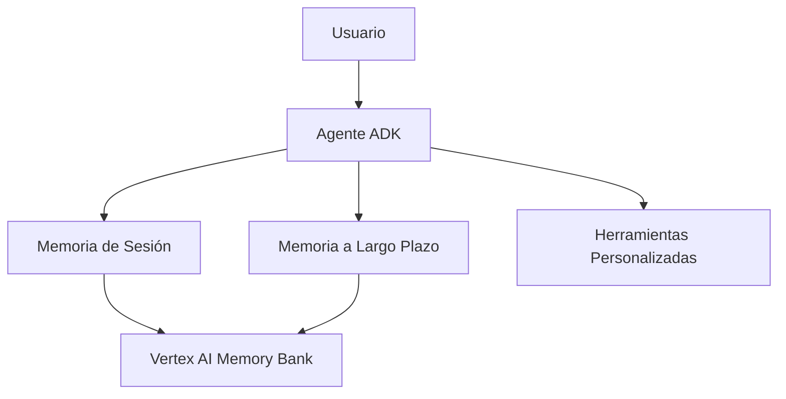

summary: Crear y Desplegar un Agente ADK en Vertex AI Agent Engine
id: crear-agente-adk-desplegar-agent-engine
categories: Vertex AI, ADK, Agents
tags: intermediate
status: Published
authors: Falcon
Feedback Link: https://cloud.google.com/vertex-ai/

# 🤖 Crear y Desplegar un Agente ADK en Vertex AI Agent Engine

Duration: 1

## 📋 Descripción General

En este codelab aprenderás a construir, desplegar y probar un agente de IA usando el **Agent Development Kit (ADK)** y **Vertex AI Agent Engine**. Crearemos un agente especializado en matemáticas y cálculos temporales que puede ejecutarse tanto localmente como en la nube.

### 🎯 Lo que aprenderás:
- Conceptos fundamentales de Vertex AI Agent Engine
- Implementación de herramientas (tools) personalizadas
- Manejo de memoria y sesiones en agentes de IA
- Despliegue en Vertex AI Agent Engine
- Testing local vs. remoto

### 🛠️ Requisitos previos:
- Python 3.12+
- Cuenta de Google Cloud con Vertex AI habilitado
- Conocimientos básicos de Python
- `gcloud` CLI configurado

---

## 🧠 Conceptos Clave de Vertex AI Agent Engine

Duration: 2

### ¿Qué es el Agent Development Kit (ADK)?

El **ADK** es un framework de Google Cloud que permite crear agentes de IA conversacionales con capacidades avanzadas:

- **🔧 Herramientas personalizadas**: Define funciones que el agente puede llamar
- **💾 Gestión de memoria**: Manejo automático de sesiones y memoria a largo plazo
- **🚀 Despliegue escalable**: Transición perfecta de desarrollo local a producción
- **🤖 Modelos avanzados**: Integración con Gemini 2.0 Flash

### Arquitectura de Memoria



#### Tipos de Memoria:

1. **📝 Memoria de Sesión (Corto plazo)**
   - Contexto conversacional dentro de una sesión
   - Manejo automático por `VertexAiSessionService`
   - Perfecta para conversaciones multi-turno

2. **🏛️ Memory Bank (Largo plazo)**
   - Conocimiento persistente entre sesiones
   - Búsqueda por similitud semántica
   - Personalización basada en historial del usuario

### Vertex AI Agent Engine 

El Vertex AI Agent Engine es la plataforma de ejecución (runtime) completamente administrada dentro de Google Cloud para desplegar, administrar y escalar Agentes de IA en entornos de producción.

Forma parte de Vertex AI Agent Builder, que es el conjunto completo de herramientas y servicios para construir y poner en marcha agentes de IA conversacionales y de flujo de trabajo. Mientras que otros componentes como el Agent Development Kit (ADK) se centran en la construcción del código del agente, el Agent Engine se enfoca en la operación del agente como un servicio en la nube.

Los agentes de IA que se ejecutan en el Agent Engine se componen típicamente de varios elementos que trabajan juntos para interpretar consultas, razonar, recuperar información y ejecutar acciones.

Los componentes principales que define Google Cloud para la anatomía de un Agente de IA, y que el Agent Engine gestiona y facilita, son:

#### 1. Modelo (Model)
Función: Es el cerebro del agente, generalmente un Modelo de Lenguaje Grande (LLM) como Gemini.

Rol: Interpreta la consulta del usuario, genera respuestas, realiza el razonamiento y decide si es necesario llamar a una herramienta externa.

#### 2. Herramientas (Tools)
Función: Son funciones o módulos externos que extienden las capacidades del agente más allá de la generación de texto. Permiten al agente realizar acciones en el mundo real o acceder a información en bases de datos.

Ejemplos: Llamadas a APIs externas, ejecución de código (Code Execution), o conexión a servicios de Google Cloud como Vertex AI Search para RAG (Generación Aumentada por Recuperación).

#### 3. Orquestación (Orchestration)
Función: Es la capa lógica que guía el comportamiento del agente. Gestiona el flujo de trabajo de múltiples pasos y el razonamiento.

Rol: Decide cuándo y qué herramienta llamar, combina la salida del modelo con los resultados de las herramientas y mantiene la coherencia en conversaciones complejas.

#### 4. Memoria (Memory)
Función: Permite que el agente recuerde interacciones pasadas dentro de una misma conversación (memoria a corto plazo) y acceda a una base de conocimiento persistente (memoria a largo plazo).

Rol: Almacena el historial de la sesión para conversaciones de múltiples turnos y ayuda al modelo a mantener el contexto y un razonamiento coherente. El Agent Engine proporciona servicios de sesión y banco de memoria para esto.

5. Despliegue (Deployment) y Runtime
Función: Es la parte que hace que el agente esté disponible como un servicio en la nube escalable y seguro. Esta es la función principal del Vertex AI Agent Engine como tal.

Rol: Proporciona un entorno de ejecución (runtime) completamente administrado, maneja la escalabilidad automática, la integración con IAM y la observabilidad (Cloud Logging, Cloud Trace).

---

## 🚀 Configuración del Entorno

Duration: 5

### 1. Preparar el proyecto

```bash
# Clonar o crear directorio del proyecto
mkdir vertex-ai-agent-project
cd vertex-ai-agent-project

# Inicializar con uv (gestor de paquetes Python)
uv init
```

### 2. Configurar dependencias

Crea el archivo `pyproject.toml`:

```toml
[project]
name = "vertex-ai-agent"
version = "0.1.0"
description = "Agente de IA con Vertex AI ADK"
requires-python = ">=3.12"
dependencies = [
    "cloudpickle>=3.1.1",
    "google-adk>=1.15.1",
    "google-cloud-aiplatform[agent-engines]==1.119.0",
    "google-genai>=1.41.0",
]

[project.scripts]
main = "main:main"
test-local = "test_local:main"
test-deploy = "test_deploy:main"
```

### 3. Instalar dependencias

```bash
uv sync
```

### 4. Configurar autenticación

```bash
# Autenticar con Google Cloud
gcloud auth login
gcloud auth application-default login

# Configurar proyecto por defecto
gcloud config set project TU_PROJECT_ID
```

---

## 💻 Implementación del Agente

Duration: 20

### 🔧 Creando Herramientas Personalizadas

Primero, definimos las funciones que nuestro agente podrá usar:

```python
import datetime

def get_current_time():
    """Obtiene la fecha y hora actual."""
    current_time = datetime.datetime.now()
    return {
        "status": "success",
        "time": current_time.strftime("%Y-%m-%d %H:%M:%S")
    }

def simple_calculator(operation: str, a: float, b: float) -> dict:
    """Realiza operaciones matemáticas básicas."""
    try:
        if operation == "add":
            result = a + b
        elif operation == "subtract":
            result = a - b
        elif operation == "multiply":
            result = a * b
        elif operation == "divide":
            result = a / b if b != 0 else "Error: División por cero"
        else:
            return {"status": "error", "message": "Operación inválida"}
        
        return {"status": "success", "result": result}
    except Exception as e:
        return {"status": "error", "message": str(e)}
```

### 🤖 Archivo Principal: `main.py`

Crea el archivo `main.py` con el siguiente contenido:

```python
#!/usr/bin/env python3
"""
Punto de entrada principal para el despliegue del motor de razonamiento de Vertex AI.
Este archivo contiene todo lo necesario para que el agente funcione en Vertex AI.
"""

import datetime
import uuid
import os
import warnings
import asyncio

warnings.filterwarnings("ignore")

import vertexai
from google.adk.agents import Agent
from vertexai.agent_engines import AdkApp

# Configuración
PROJECT_ID = os.environ.get("GOOGLE_CLOUD_PROJECT", "tu-project-id")
LOCATION = os.environ.get("GOOGLE_CLOUD_REGION", "us-central1")
STAGING_BUCKET = "gs://vertex-ai-staging-bucket"

# Inicializar Vertex AI
vertexai.init(
    project=PROJECT_ID,
    location=LOCATION,
    staging_bucket=STAGING_BUCKET,
)

client = vertexai.Client(project=PROJECT_ID, location='us-central1')

# Definir funciones de herramientas
def get_current_time():
    """Devuelve la fecha y hora actuales."""
    current_time = datetime.datetime.now()
    return {
        "status": "success",
        "time": current_time.strftime("%Y-%m-%d %H:%M:%S")
    }

def simple_calculator(operation: str, a: float, b: float) -> dict:
    """Realiza operaciones matemáticas básicas."""
    try:
        if operation == "add":
            result = a + b
        elif operation == "subtract":
            result = a - b
        elif operation == "multiply":
            result = a * b
        elif operation == "divide":
            result = a / b if b != 0 else "Error: División por cero"
        else:
            return {"status": "error", "message": "Operación inválida"}
        
        return {"status": "success", "result": result}
    except Exception as e:
        return {"status": "error", "message": str(e)}

# Crear la aplicación ADK
app = AdkApp(agent=Agent(
    name=f"math_expert_agent_{uuid.uuid4().hex[:8]}",
    model="gemini-2.0-flash",
    global_instruction=(
        """
        Eres un experto en matemáticas y cálculos de fecha y hora.
        Puedes ayudar con operaciones matemáticas básicas y consultas temporales.
        Siempre sé preciso y explica tus cálculos cuando sea apropiado.
        """
    ),
    tools=[get_current_time, simple_calculator]
))

# Desplegar en Vertex AI Agent Engine
remote_app = client.agent_engines.create(
    agent=app,
    config={
        "requirements": [
            "cloudpickle",
            "google-adk>=1.15.1",
            "google-genai",
            "google-cloud-discoveryengine",
            "google-cloud-aiplatform[agent-engines]==1.119.0",
        ],
        "staging_bucket": STAGING_BUCKET,
    },
)

print(f"🎉 ¡Despliegue terminado!")
print(f"🤖 Motor del Agente: {app}")

def main():
    """Función principal para el despliegue"""
    print("✅ ¡Agente inicializado exitosamente!")
    return app

if __name__ == "__main__":
    main()
```

### 🧪 Testing Local: `test_local.py`

Para desarrollo y pruebas locales, crea `test_local.py`:

```python
#!/usr/bin/env python3
"""
Script de pruebas locales para el agente ADK sin desplegar a Vertex AI.
Esto ejecuta el agente localmente para propósitos de desarrollo y testing.
"""

import datetime
import uuid
import asyncio
import warnings

warnings.filterwarnings("ignore")

import vertexai
from google.adk.agents import Agent
from vertexai.agent_engines import AdkApp

# Configuración
PROJECT_ID = "tu-project-id"
LOCATION = "us-central1"
STAGING_BUCKET = "gs://vertex-ai-staging-bucket"

# Inicializar Vertex AI
vertexai.init(
    project=PROJECT_ID,
    location=LOCATION,
    staging_bucket=STAGING_BUCKET,
)

# Definir funciones de herramientas (igual que main.py)
def get_current_time():
    """Devuelve la fecha y hora actuales."""
    current_time = datetime.datetime.now()
    return {
        "status": "success",
        "time": current_time.strftime("%Y-%m-%d %H:%M:%S")
    }

def simple_calculator(operation: str, a: float, b: float) -> dict:
    """Realiza operaciones matemáticas básicas."""
    try:
        if operation == "add":
            result = a + b
        elif operation == "subtract":
            result = a - b
        elif operation == "multiply":
            result = a * b
        elif operation == "divide":
            result = a / b if b != 0 else "Error: División por cero"
        else:
            return {"status": "error", "message": "Operación inválida"}
        
        return {"status": "success", "result": result}
    except Exception as e:
        return {"status": "error", "message": str(e)}

# Crear agente y app ADK local (sin despliegue)
agent = Agent(
    name=f"local_test_agent_{uuid.uuid4().hex[:8]}",
    model="gemini-2.0-flash",
    global_instruction=(
        """
        Eres un experto en matemáticas y análisis de datos.
        Te estás ejecutando localmente para propósitos de prueba.
        """
    ),
    tools=[get_current_time, simple_calculator]
)

app = AdkApp(agent=agent)

async def chat_with_agent(message: str, user_id: str = "test_user", session_id: str = None):
    """Envía un mensaje al agente ADK local y obtiene respuesta"""
    try:
        # Crear sesión si no se proporciona
        if session_id is None:
            session = await app.async_create_session(user_id=user_id)
            session_id = session.id
        
        print(f"🤖 Enviando mensaje: '{message}'")
        print("📝 Respuesta:")
        
        # Enviar consulta y recopilar respuesta
        final_response = ""
        async for event in app.async_stream_query(
            user_id=user_id,
            session_id=session_id,
            message=message
        ):
            # Extraer texto del diccionario de evento
            if isinstance(event, dict) and 'content' in event:
                content = event['content']
                if content.get('role') == 'model' and 'parts' in content:
                    for part in content['parts']:
                        if 'text' in part and part['text']:
                            text = part['text']
                            print(text, end='', flush=True)
                            final_response += text
        
        print("\n" + "="*50)
        return final_response if final_response else "No se recibió respuesta de texto"
    
    except Exception as e:
        error_msg = f"Error: {str(e)}"
        print(error_msg)
        return error_msg

async def interactive_chat():
    """Sesión de chat interactiva con el agente local"""
    print("🚀 Prueba de Agente ADK Local")
    print(f"📋 Nombre del Agente: {agent.name}")
    print("💬 Escribe 'quit' o 'exit' para terminar la sesión")
    print("="*50)
    
    user_id = "local_test_user"
    session = await app.async_create_session(user_id=user_id)
    session_id = session.id
    
    while True:
        try:
            message = input("\n👤 Tú: ").strip()
            
            if message.lower() in ['quit', 'exit', 'q']:
                print("👋 ¡Adiós!")
                break
            
            if not message:
                continue
            
            await chat_with_agent(message, user_id, session_id)
            
        except KeyboardInterrupt:
            print("\n👋 ¡Adiós!")
            break
        except Exception as e:
            print(f"❌ Error: {e}")

async def run_test_cases():
    """Ejecutar algunos casos de prueba predefinidos"""
    print("🧪 Ejecutando Casos de Prueba")
    print("="*50)
    
    test_cases = [
        "¡Hola! ¿En qué me puedes ayudar?",
        "¿Qué hora es ahora mismo?",
        "Calcula 15 + 27",
        "¿Cuánto es 100 dividido por 4?",
        "¿Puedes multiplicar 8 por 12?",
        "Cuéntame sobre ciencia de datos",
    ]
    
    for i, test_case in enumerate(test_cases, 1):
        print(f"\n📝 Prueba {i}/{len(test_cases)}")
        await chat_with_agent(test_case)
        await asyncio.sleep(1)  # Pequeña pausa entre pruebas

async def main():
    """Función principal para testing local"""
    print("🏠 Testing Local de Agente ADK")
    print("="*50)
    
    while True:
        print("\nElige una opción:")
        print("1. Ejecutar chat interactivo")
        print("2. Ejecutar casos de prueba")
        print("3. Prueba de mensaje único")
        print("4. Salir")
        
        try:
            choice = input("\nIngresa tu elección (1-4): ").strip()
            
            if choice == "1":
                await interactive_chat()
            elif choice == "2":
                await run_test_cases()
            elif choice == "3":
                message = input("Ingresa tu mensaje: ").strip()
                if message:
                    await chat_with_agent(message)
            elif choice == "4":
                print("👋 ¡Adiós!")
                break
            else:
                print("❌ Elección inválida. Por favor ingresa 1, 2, 3, o 4.")
                
        except KeyboardInterrupt:
            print("\n👋 ¡Adiós!")
            break
        except Exception as e:
            print(f"❌ Error: {e}")

if __name__ == "__main__":
    asyncio.run(main())
```

---

## 🧪 Testing y Validación

### 1. Testing Local

```bash
# Ejecutar pruebas locales
uv run python test_local.py
```

**Opciones disponibles:**
- **Chat interactivo**: Conversa en tiempo real con el agente
- **Casos de prueba**: Ejecuta escenarios predefinidos
- **Mensaje único**: Prueba rápida de un mensaje

### 2. Desplegar a Vertex AI

```bash
# Desplegar el agente
uv run python main.py
```

El script mostrará:
```
🎉 ¡Despliegue terminado!
🤖 Motor del Agente: <AdkApp object>
```

### 3. Testing del Agente Desplegado

Crea `test_deploy.py` para probar el agente en la nube:

```python
import asyncio
import vertexai
from vertexai import agent_engines

async def main():
    """Crea una sesión e interactúa con el motor del agente."""
    # Reemplaza con el ID de tu agente desplegado
    remote_app = agent_engines.get('TU_AGENT_ENGINE_ID')
    print(f"Motor del agente: {remote_app.display_name}")
    
    try:
        session = await remote_app.async_create_session(user_id='usuario_123')
        print(f"Sesión creada: {session}")
        
        session_id = session['id'] if isinstance(session, dict) else session.name
        print(f"Usando ID de sesión: {session_id}")
        
        response = remote_app.async_stream_query(
            message="Hola, ¿en qué me puedes ayudar?",
            user_id='usuario_123',
            session_id=session_id
        )
        
        async for chunk in response:
            if isinstance(chunk, dict) and 'content' in chunk:
                content = chunk['content']
                if 'parts' in content and content['parts']:
                    text = content['parts'][0].get('text', '')
                    if text:
                        print(f"Respuesta: {text}")
                        
    except Exception as e:
        print(f"Error durante la interacción de sesión: {e}")

# Ejecutar la función async main
asyncio.run(main())
```

---

## 🔍 Casos de Uso y Ejemplos

### Ejemplos de Interacciones

```python
# Consulta temporal
"¿Qué hora es?"
# Respuesta: "La hora actual es 2024-01-15 14:30:45"

# Operaciones matemáticas
"Calcula 25 multiplicado por 8"
# Respuesta: "25 × 8 = 200"

# Operaciones complejas
"Si tengo $1000 y gano 15% de interés mensual durante 3 meses, ¿cuánto tendré?"
# El agente usará la calculadora multiple veces para calcular el interés compuesto
```

### Personalización del Agente

Puedes modificar las `global_instruction` para cambiar el comportamiento:

```python
global_instruction=(
    """
    Eres un asistente financiero especializado.
    - Siempre proporciona explicaciones detalladas de los cálculos
    - Usa términos financieros apropiados
    - Sugiere mejores prácticas financieras cuando sea relevante
    """
)
```

---

## 🚀 Despliegue y Escalado

### Configuración de Producción

1. **Variables de entorno**:
```bash
export GOOGLE_CLOUD_PROJECT="tu-proyecto-produccion"
export GOOGLE_CLOUD_REGION="us-central1"
export VERTEX_AI_STAGING_BUCKET="gs://tu-bucket-produccion"
```

2. **Configuración de memoria avanzada**:
```python
from google.adk.memory import VertexAiMemoryBankService

# Agregar Memory Bank para memoria a largo plazo
memory_service = VertexAiMemoryBankService(
    project_id=PROJECT_ID,
    location=LOCATION,
    corpus_id="tu-corpus-id"
)

agent = Agent(
    name="agent_with_memory",
    model="gemini-2.0-flash",
    global_instruction=instruction,
    tools=tools,
    memory_service=memory_service  # Memoria persistente
)
```

### Monitoreo y Logs

```python
import logging

# Configurar logging
logging.basicConfig(level=logging.INFO)
logger = logging.getLogger(__name__)

# En tu agente
logger.info(f"Agente iniciado: {agent.name}")
logger.info(f"Herramientas disponibles: {[tool.__name__ for tool in tools]}")
```

---

## 🔧 Troubleshooting

### Problemas Comunes

1. **Error de autenticación**:
```bash
# Verificar autenticación
gcloud auth list
gcloud auth application-default login
```

2. **Dependencias faltantes**:
```bash
# Reinstalar dependencias
uv sync --force
```

3. **Problemas de permisos en Vertex AI**:
```bash
# Verificar permisos del proyecto
gcloud projects get-iam-policy TU_PROJECT_ID
```

4. **Error en staging bucket**:
```bash
# Crear bucket si no existe
gsutil mb gs://tu-vertex-ai-staging-bucket
```

---

## 📚 Recursos Adicionales

### Documentación oficial:
- [Vertex AI Agent Development Kit](https://cloud.google.com/vertex-ai/generative-ai/docs/agent-development-kit/)
- [Agent Engine Memory Bank](https://cloud.google.com/vertex-ai/generative-ai/docs/agent-engine/memory-bank/overview)
- [ADK Tools Documentation](https://google.github.io/adk-docs/)

### Mejores prácticas:
1. **Seguridad**: Nunca hardcodear credenciales en el código
2. **Testing**: Siempre probar localmente antes de desplegar
3. **Monitoring**: Implementar logging apropiado para producción
4. **Escalabilidad**: Usar Memory Bank para aplicaciones con múltiples usuarios

---

## 🎯 Próximos Pasos

1. **Expandir herramientas**: Agrega más funciones personalizadas
2. **Implementar Memory Bank**: Para memoria a largo plazo
3. **Integración con APIs**: Conecta con servicios externos
4. **UI Frontend**: Crear una interfaz web para tu agente
5. **Monitoreo avanzado**: Implementar métricas y alertas

¡Felicidades! Has creado exitosamente un agente de IA con Vertex AI ADK. 🎉